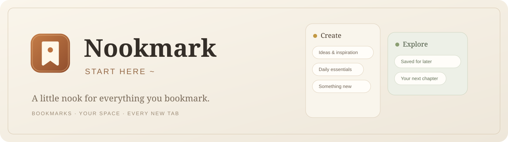
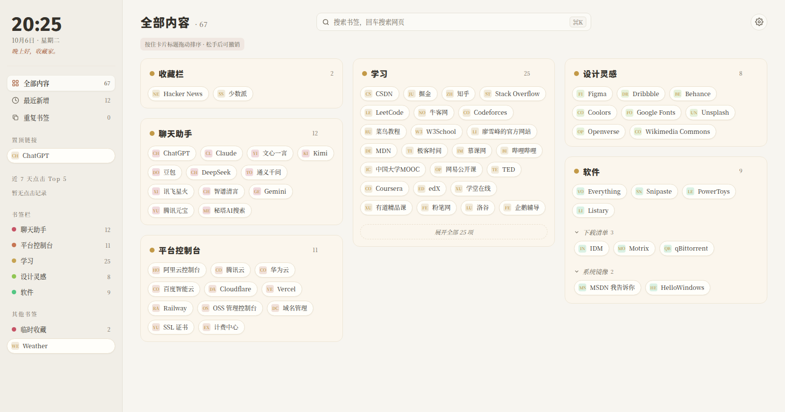
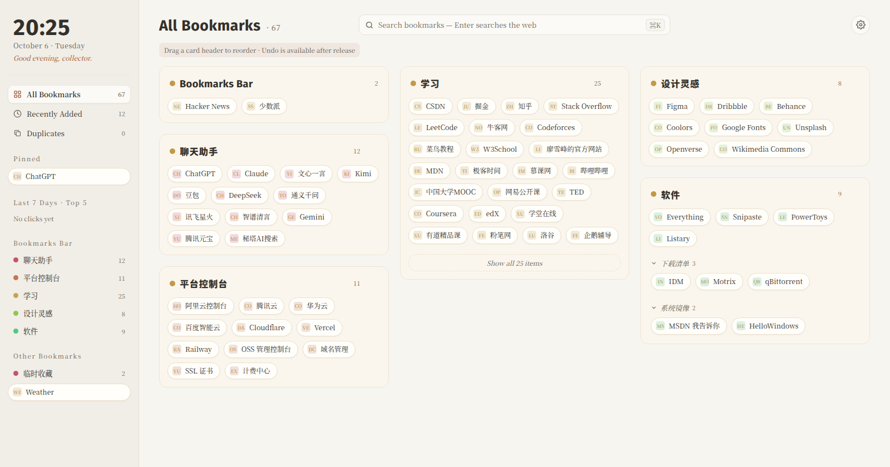

<div align="center">


# Nookmark

### 从这里启程～ · Start Here~

**给书签一个温暖的小角落，让每个新标签页都成为你的起点。**

*A little nook for everything you bookmark.*

[简体中文](README.md) · [English](README.en.md)

[](https://github.com/QuasarG/nookmark/releases/latest)
[](manifest.json)
[](newtab.js)
[](LICENSE)
[](README.en.md)

[下载最新版](https://github.com/QuasarG/nookmark/releases/latest) · [快速安装](#-安装) · [使用范例](#-使用范例--examples) · [反馈问题](https://github.com/QuasarG/nookmark/issues)

</div>



## ✨ 你的书签，值得更舒服的打开方式

Nookmark 是一款 Chrome 新标签页扩展，把真实书签整理成温暖、轻盈的卡片。找到常用链接、整理收藏、换一张喜欢的壁纸，然后从这里启程。

`新标签页` `书签管理` `即时搜索` `壁纸自定义` `中英双语` `暖纸面设计`

## 🖼️ 页面一览



> 实际页面截图，使用项目自带的演示书签；不包含个人书签。标题与时钟使用内置未来荧黑 ExtraBold，正文使用思源宋体。

<details>
<summary>查看英文页面 · English preview</summary>



</details>

## 🧭 功能地图

| 功能 | 你可以做什么 |
| :-- | :-- |
| **卡片书签** | 按文件夹浏览书签，展开子文件夹，记住折叠状态；隐藏暂时不用的文件夹 |
| **即时搜索** | 输入即显示匹配书签，用方向键选择，回车打开；无匹配时使用默认引擎搜索网页 |
| **网页搜索** | Google、Bing、百度、DuckDuckGo、搜狗、360 搜索；提示中展示对应引擎图标 |
| **置顶与 Top 5** | 把重要链接放进固定区域，查看从本页面点击的近 7 天 Top 5 |
| **右键菜单** | 页面、链接、文件夹和搜索框都有对应菜单；支持打开、复制、置顶、编辑和移动等操作 |
| **整理书签** | 修改名称、网址，移动到文件夹（包括空文件夹）；直接同步到 Chrome 真实书签 |
| **重复检查** | 按完整网址查看重复副本及路径，删除需确认，并提供 8 秒撤销 |
| **拖拽排序** | 按住卡片标题拖动，卡片跟随光标，其他卡片以弹簧动效让位；保存后可撤销 |
| **背景与配色** | 上传本地壁纸，或选择纯色/渐变；调整亮度、模糊、遮罩和背景位置 |
| **首页布局** | 开关侧栏模块、调整模块顺序，切换卡片密度和透明度 |
| **双语与主题** | 中文 / English、浅色 / 深色 / 跟随系统，时钟与秒数可配置 |

**书签编辑会改变 Chrome 的真实书签。** 卡片视觉排序、置顶和点击统计是 Nookmark 的页面偏好，不等同于调整 Chrome 原生书签栏顺序。

## 📦 安装

前往 **[Releases](https://github.com/QuasarG/nookmark/releases/latest)** 下载。`nookmark.crx` 为签名安装包，`nookmark.zip` 为扩展文件压缩包。

### 方式一：ZIP 加载 · 各桌面平台

1. 下载并解压 `nookmark.zip`，保留解压后的文件夹。
2. 在 Chrome 打开 `chrome://extensions`，开启右上角的「开发者模式」。
3. 点击「加载已解压的扩展程序」，选择含有 `manifest.json` 的文件夹。
4. 打开一个新标签页。

### 方式二：CRX 安装 · Linux Chrome

1. 下载 `nookmark.crx`。
2. 打开 `chrome://extensions`，开启「开发者模式」。
3. 把 CRX 拖入扩展页面，确认添加。

Windows、macOS 的普通 Chrome 对商店外 CRX 有限制，推荐使用 ZIP 加载方式。详见 [Chrome 官方分发说明](https://developer.chrome.com/docs/extensions/how-to/distribute)。

### 更新与首次迁移

- ZIP 版本：用新版文件替换原目录中的扩展文件，然后在扩展管理页面点击「重新加载」。
- CRX 版本：安装新版本的 CRX；官方包复用同一签名密钥，保持扩展 ID。
- 开发版与 CRX 版可能使用不同 ID，置顶、布局等扩展设置不会自动迁移。
- 当前没有自动更新服务。移除扩展可能清除它的本地设置与壁纸，更新时请保留原安装。

## ⌨️ 使用范例 · Examples

### 01 / 找到链接 · Find a bookmark

| 中文模式 | English mode |
| :-- | :-- |
| 输入 `GitHub` → `↓` / `↑` 选择结果 → `Enter` 打开 | Type `GitHub` → select with `↓` / `↑` → press `Enter` |
| 输入没有匹配的关键词 → 提示显示默认引擎图标 → `Enter` 搜索网页 | Type an unmatched query → see your engine's icon → press `Enter` to search the web |
| `Esc` 收起搜索建议 | Press `Esc` to dismiss suggestions |

**例子：** 默认引擎选 Google，输入 `明天的天气`，没有书签匹配时，回车即可使用 Google 搜索。

*Example: choose Bing, type `weather tomorrow`, and press Enter when no bookmark matches.*

### 02 / 留住重要链接 · Keep essentials close

**中文：** 右键 `GitHub` →「置顶链接」。它会出现在侧栏置顶区域；再次右键可以取消置顶。

**English:** Right-click `GitHub` → **Pin link**. It appears in the pinned section; right-click again to unpin.

### 03 / 整理收藏 · Tidy your collection

**中文：** 右键书签 →「编辑书签」修改名称或网址；选择「移动到文件夹」改变所在位置。拖动卡片标题调整页面顺序，误操作时点击撤销。

**English:** Right-click a bookmark to edit its title or URL, or move it to another folder. Drag a card header to reorder the page, then use **Undo** if needed.

### 04 / 打造自己的首页 · Make it yours

**中文：** 设置 →「背景与配色」→ 上传本地图片 → 调整遮罩与模糊 → 选择青苔配色和半透明卡片。

**English:** Settings → **Background & Palette** → upload an image → adjust overlay and blur → choose a palette and translucent cards.

## 🎨 设计语言

**像一页被认真整理过的纸，而不是一排拥挤的入口。**

| 元素 | 设计选择 |
| :-- | :-- |
| **标识** | 暖棕色封面、书签切口与圆点，呼应「收藏」和「起点」 |
| **色彩** | 暖纸面底色，暖纸 / 青苔 / 海蓝 / 玫瑰四组配色，搭配柔和边框 |
| **字体** | 未来荧黑 ExtraBold 带来醒目的标题；思源宋体保持正文的阅读感 |
| **结构** | 左侧导航 + 居中搜索 + 瀑布流卡片，让分类与内容各就其位 |
| **动效** | 渐变菜单、拖拽弹簧反馈、时钟滚动，并适配减少动态效果偏好 |
| **个性化** | 纯色、晨光 / 林间 / 暮色渐变、本地壁纸与透明卡片 |

Logo 为项目内的 [SVG 标识](logo.svg)，文档横幅位于 [docs/images/banner.svg](docs/images/banner.svg)。两张样例图均由实际页面生成。

## 🔒 数据与权限

Nookmark 没有独立后端，不会把你的壁纸上传到项目服务器。

| 内容 / 权限 | 用途 |
| :-- | :-- |
| `bookmarks` | 读取、编辑、移动和删除 Chrome 书签 |
| `storage` | 保存外观、布局、置顶、点击统计等偏好 |
| `favicon` | 显示书签网站图标 |
| 本地存储 | 壁纸、外观细项、折叠状态和点击统计 |
| Chrome 同步存储 | 语言、基础主题、卡片顺序及置顶等偏好；取决于 Chrome 同步设置 |

Top 5 统计的是通过 Nookmark 打开的链接，不是全浏览器历史。打开书签、网页搜索会访问对应网站；预览模式可能请求网站 favicon。搜索引擎提示图标已内置，可离线显示。

## 🛠️ 开发与验证

原生 HTML / CSS / JavaScript，Manifest V3，无需构建页面。

```bash
git clone https://github.com/QuasarG/nookmark.git
cd nookmark
```

在 Chrome 通过「加载已解压的扩展程序」选择项目目录。修改源码后重新加载扩展。

### 浏览器测试

需要 Node.js 与 Playwright：

```bash
npm install --no-save --package-lock=false playwright
npx playwright install chromium
node --test tests/browser.cjs
```

也可指定已有 Chrome，跳过下载测试浏览器：

```bash
CHROME_BIN=/path/to/chrome node --test tests/browser.cjs
```

测试覆盖搜索引擎图标、壁纸与模块持久化、折叠状态、书签编辑移动、重复检查和撤销、窄屏与拖拽。使用独立浏览器配置和演示书签。

### 打包 CRX / ZIP

需要 Python 3 与 Chrome：

```bash
python scripts/package.py
# 手动指定 Chrome：
CHROME_BIN=/path/to/chrome python scripts/package.py
```

- 生成 `nookmark.crx` 与 `nookmark.zip`，包含运行文件、字体及许可证。
- 签名密钥存放在 `.extension-signing/nookmark.pem`，仅本地保存，不进入 Git 或安装包。
- 保留同一密钥，才能保持你打包的 CRX 扩展 ID；自己的密钥会产生不同于官方包的 ID。
- 文档、样例图、测试与开发文件不进入安装包。

### 项目结构

```text
nookmark/
├── manifest.json             # Chrome 扩展清单
├── newtab.html / css / js    # 新标签页与主交互
├── preferences.js           # 个性化与书签整理
├── logo.svg / icon*.png      # 品牌与扩展图标
├── assets/engines/           # 本地搜索引擎标识
├── fonts/                   # 内置字体与 OFL 授权
├── docs/images/             # README 横幅与页面样例
├── scripts/package.py       # CRX / ZIP 打包
└── tests/browser.cjs         # 浏览器验证
```

## 📄 授权与致谢

项目采用 **[Nookmark 非商业源码许可](LICENSE)**：

- 允许非商业使用、修改和分发；分发须保留授权并提供对应的可编辑源码。
- 未经权利人书面许可，禁止商业利用、闭源分发，以及上传本项目或衍生版本到任何扩展 / 应用商店。
- 这是带用途限制的 **源码可见许可**，不属于 OSI 标准开源许可。完整条款以 `LICENSE` 为准。

**第三方字体独立采用 OFL 1.1**：未来荧黑来自 [Project Wêlai](https://github.com/welai/glow-sans)，思源宋体来自 [Adobe](https://github.com/adobe-fonts/source-han-serif)。字体随包分发，附有版权与授权；思源宋体 WOFF2 派生版本的内部名称为 Nookmark Serif。搜索引擎标识归各自权利人所有。详见 [第三方声明](THIRD_PARTY_NOTICES.md)。

---

<div align="center">

**Nookmark · 收藏你的世界，从这里启程。**

[下载](https://github.com/QuasarG/nookmark/releases/latest) · [English](README.en.md) · [反馈](https://github.com/QuasarG/nookmark/issues)

</div>
